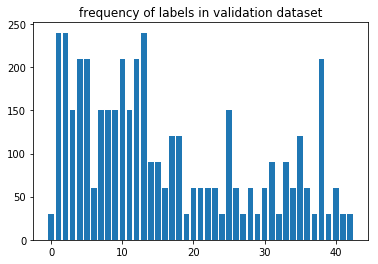
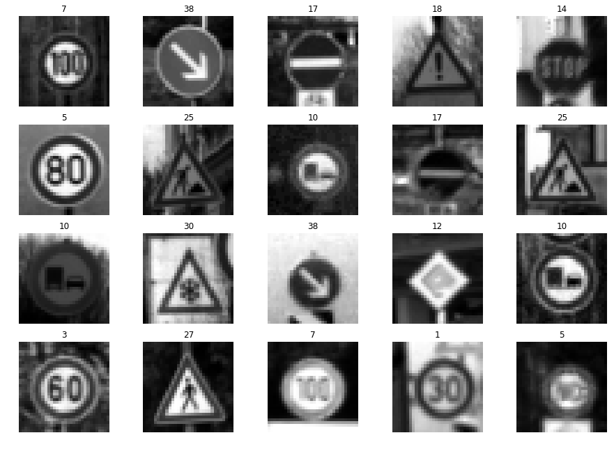
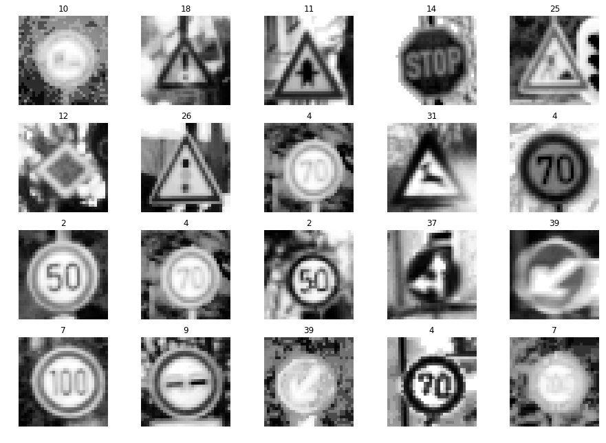
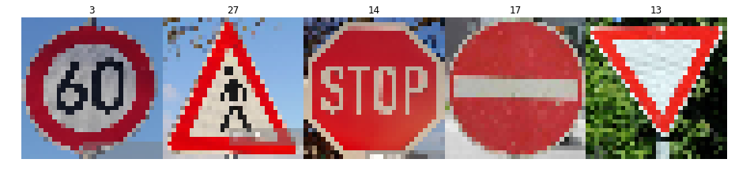

# **Traffic Sign Recognition** 

## Writeup

### You can use this file as a template for your writeup if you want to submit it as a markdown file, but feel free to use some other method and submit a pdf if you prefer.

---

**Build a Traffic Sign Recognition Project**

The goals / steps of this project are the following:
* Load the data set (see below for links to the project data set)
* Explore, summarize and visualize the data set
* Design, train and test a model architecture
* Use the model to make predictions on new images
* Analyze the softmax probabilities of the new images
* Summarize the results with a written report

[//]: # (Image References)

[image1]: ./examples/visualization.jpg "Visualization"
[image2]: ./examples/grayscale.jpg "Grayscaling"
[image3]: ./examples/random_noise.jpg "Random Noise"
[image4]: ./examples/placeholder.png "Traffic Sign 1"
[image5]: ./examples/placeholder.png "Traffic Sign 2"
[image6]: ./examples/placeholder.png "Traffic Sign 3"
[image7]: ./examples/placeholder.png "Traffic Sign 4"
[image8]: ./examples/placeholder.png "Traffic Sign 5"

## Rubric Points
### Here I will consider the [rubric points](https://review.udacity.com/#!/rubrics/481/view) individually and describe how I addressed each point in my implementation.  

---
### Writeup / README

#### 1. Provide a Writeup / README that includes all the rubric points and how you addressed each one. You can submit your writeup as markdown or pdf. You can use this template as a guide for writing the report. The submission includes the project code.

You're reading it :) :) 
(I was asked to resubmit with writeup file, but even in my previous submission writeup file was there as markdown cell in jupyter notebook at the end of code blocks and also in the html file :) :))

### Data Set Summary & Exploration

#### 1. Provide a basic summary of the data set. In the code, the analysis should be done using python, numpy and/or pandas methods rather than hardcoding results manually.

I used python, numpy to calculate summary statistics of the traffic

* The size of training set is : 34799
* The size of the validation set is : 4410
* The size of test set is : 12630
* The shape of a traffic sign image is : (32, 32, 3)
* The number of unique classes/labels in the data set is : 43

#### 2. Include an exploratory visualization of the dataset.

Here is an exploratory visualization of the data set. These are bar charts showing the frequency of labels in each of train, validation and test sets.

### Design and Test a Model Architecture

#### 1. Describe how you preprocessed the image data. What techniques were chosen and why did you choose these techniques? Consider including images showing the output of each preprocessing technique. Pre-processing refers to techniques such as converting to grayscale, normalization, etc. (OPTIONAL: As described in the "Stand Out Suggestions" part of the rubric, if you generated additional data for training, describe why you decided to generate additional data, how you generated the data, and provide example images of the additional data. Then describe the characteristics of the augmented training set like number of images in the set, number of images for each class, etc.)

As a first step, though I believed color images will have more useful features for traffic image classification, results were different, so I decided to convert the images to grayscale as mentioned in the paper ((Sermanet/LeCun) given for reference. Later I did local histogram equalization, normalizaition and put them in a preprocessing pipeline. The paper discussed global and local equalization but I just did local equalization. As a last step, I normalized the image data to have a [0,1] scale

I wanted to generate additional data but faced some problems with it as it created a lot of confusion while augmenting, transform, joining with input data, preprocessing.. many errors popped up, took lot of time, hence I decided to do it on my own after submitting this version.

Here are some images after grayscaling.

Here are some images after local histogram equalization.

Here are some images after normalization.

#### 2. Describe what your final model architecture looks like including model type, layers, layer sizes, connectivity, etc.) Consider including a diagram and/or table describing the final model.

 My final model consisted of the following layers:

| Layer         		|     Description	        					| 
|:---------------------:|:---------------------------------------------:| 
| Input         		| 32x32x1 Gray image   							| 
| Convolution 5x5     	| 1x1 stride, valid padding, outputs 28x28x6 	|
| RELU					|												|
| Max pooling	      	| 2x2 stride,  outputs 14x14x6  				|
| Convolution 5x5	    | 1x1 strid, valid padding, outputs 10x10x16    |
| RELU                  |                                               |
| Max pooling           | 2x2 stride,  outputs 5x5x16                   |
| Flatten       	    | outputs 400                                   |
| Fully connected		| outputs 120  									|
| RELU					|												|
| Fully connected		| outputs 84 									|
| RELU					|												|
| Fully connected		| outputs 10  									|

 

#### 3. Describe how you trained your model. The discussion can include the type of optimizer, the batch size, number of epochs and any hyperparameters such as learning rate.

To train the model, I tried different combinations based on the accuracy each time and finalized on below values:

| Batch size         | 100           |
| EPOCHS             | 150           |
| learning rate      | 0.001         |
| mu                 | 0             |
| sigma              | 0.1           |
| regulizer constant | 1e-6          |
| optimizer          | AdamOptimizer |

#### 4. Describe the approach taken for finding a solution and getting the validation set accuracy to be at least 0.93. Include in the discussion the results on the training, validation and test sets and where in the code these were calculated. Your approach may have been an iterative process, in which case, outline the steps you took to get to the final solution and why you chose those steps. Perhaps your solution involved an already well known implementation or architecture. In this case, discuss why you think the architecture is suitable for the current problem.

My final model results were:
* training set accuracy of 100%
* validation set accuracy of 96.2% 
* test set accuracy of 93.8%

Initially I started by implementing the same architecture from classroom LeNet Lab by changing the input(3), ouput(43) as I decided use 3 color channels because I somehow felt colors will also useful features in detecting traffic signs, then generating additional data, regulization and adding dropouts. But the accuracy wasn't good. Later I tried to convert to YUV, then taking Y channel only as discussed in the paper (Sermanet/LeCun) given for reading. However, had some problems with it too. Finally I converted the images to grayscale, did above mentioned preprocessing, regularization and after trail & error, finalized the above hyper parameters.

### Test a Model on New Images

#### 1. Choose five German traffic signs found on the web and provide them in the report. For each image, discuss what quality or qualities might be difficult to classify.

Here are five German traffic signs that I found on the web:

I believe all these images should be easy to predict as they are more brighter, clearer than trianing images. However, model was predicting 60 km/h as 50 km/h for first image. This could be because precision is low for 60 km/h and augmenting data would help.

#### 2. Discuss the model's predictions on these new traffic signs and compare the results to predicting on the test set. At a minimum, discuss what the predictions were, the accuracy on these new predictions, and compare the accuracy to the accuracy on the test set (OPTIONAL: Discuss the results in more detail as described in the "Stand Out Suggestions" part of the rubric).

Here are the results of the prediction:

| Image			        |     Prediction	        					| 
|:---------------------:|:---------------------------------------------:| 
| 60 km/h       		| 50 km/h   									| 
| Pedestrians     		| Pedestrians 									|
| Stop Sign				| Stop Sign										|
| No entry	      		| No entry				   	  		    		|
| Yield				    | Yield	      				        			|
 
The model was able to correctly guess 4 of the 5 traffic signs and test accuracy is 80%. Model was performing with 100% accuracy on train set and 96.2% accuracy on validation test, and 93.8% accuracy on test set. Looks like model was able to predict the images that it has seen very well. Also the problem was with 60 km/h image which looks similar to 50 km/h. This could be because precision is low for 60 km/h and augmenting data would help.

#### 3. Describe how certain the model is when predicting on each of the five new images by looking at the softmax probabilities for each prediction. Provide the top 5 softmax probabilities for each image along with the sign type of each probability. (OPTIONAL: as described in the "Stand Out Suggestions" part of the rubric, visualizations can also be provided such as bar charts)

For the fourth & fifth images, the model was correct with a probability of 1.0. For the first image, model was incorrectly guessing 60 km/h as 50 km/h with probability 1.0, for the second image top probability was 0.9 and for third image top probability was 0.7. The top five soft max probabilities for all 5 images were:

First Image:

| Probability         	|     Prediction	        					| 
|:---------------------:|:---------------------------------------------:| 
| 1.0         			| 50 km/h   									| 
| .0     				| 60 km/h 										|
| .0					| 80 km/h										|
| .0	      			| 20 km/h					 				    |
| .0				    | Road work      							    |

Second Image:

| Probability         	|     Prediction	        					| 
|:---------------------:|:---------------------------------------------:| 
| .9         			| Pedestrians   								| 
| .1     				| General Caution 							    |
| .0					| Right-of-way at the next intersection			|
| .0	      			| Road narrows on the right					 	|
| .0				    | Traffic signals      							|

Third Image:

| Probability         	|     Prediction	        					| 
|:---------------------:|:---------------------------------------------:| 
| .7         			| Stop sign   									| 
| .3     				| 50 km/h 										|
| .0					| Keep right									|
| .0	      	        | Yield					 				        |
| .0				    | 60 km/p      							        |

Fourth Image:

| Probability         	|     Prediction	        					| 
|:---------------------:|:---------------------------------------------:| 
| 1.0         			| No entry   									| 
| .0     				| Roundabout mandatory 							|
| .0					| No passing									|
| .0	      			| Go straight or left					 		|
| .0				    | End of all speed and passing limits      		|

Fifth Image:

| Probability         	|     Prediction	        					| 
|:---------------------:|:---------------------------------------------:| 
| 1.0         			| Yield     									| 
| .0     				| No passing 									|
| .0					| No passing for vehicles over 3.5 metric tons	|
| .0	      			| Ahead only					 				|
| .0				    | Double curve      							|

### (Optional) Visualizing the Neural Network (See Step 4 of the Ipython notebook for more details)
#### 1. Discuss the visual output of your trained network's feature maps. What characteristics did the neural network use to make classifications?

